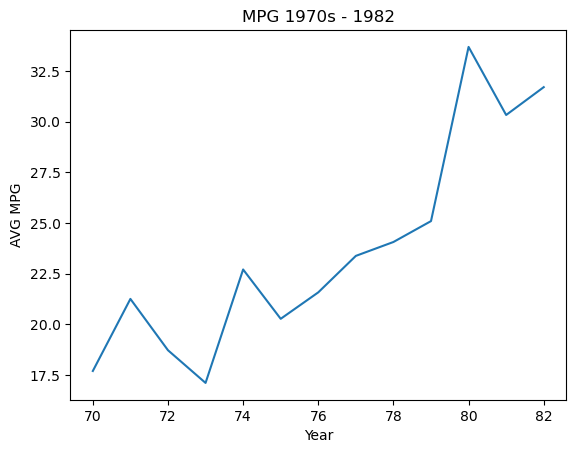
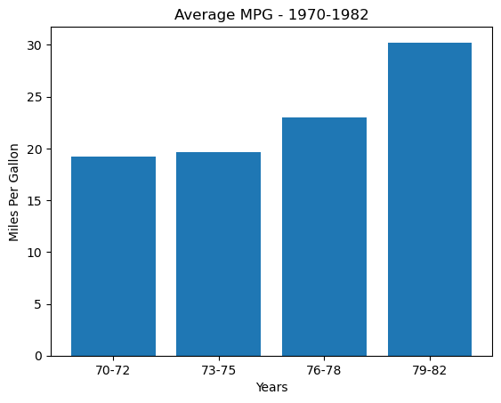

# Exploring Vehicle Miles Per Gallon 1970-1982

## Background(About the Data)
This dataset was received via Galanize for the purpose of our case study on a vehicle dataset containing vehicle details from 1970-1982.  The bit of data that immediately stood out to us was the information regarding miles per gallon.

## Parsing the data

Our first steps was to import our csv into a usable DataFrame from which we could pull our informations. To produce this we first created a .py file function that could take the relative file path to our csv and generate a usable product that was alterd to fit our specifications. Changes made to the original data set mostly included renaming columns and seberating the car_name column into a 'make' and 'model' column for more specfic indexing.

```python
def df_generator(file_path):
    '''Generates a df from cars.csv and cleans the data to prepare it for further examination. This function assumes that the dataset you are using is an updated version of cars.csv and has the same original
       structure. If the dataset you are inputing into this function is not an updated version of cars.csv it will not work as intended.'''

    df = pd.read_csv(file_path)
    '''Create dataframe from relative filepath.'''


    df.rename(columns={'model':'year'}, inplace=True)
    '''Renames column model to year.'''


    df['make'] = df['car_name'].str.split().str[0]
    df['model'] = df['car_name'].str.split().str[1:].str.join(' ')
    df.drop('car_name', axis=1, inplace=True)
    '''Splits the car_name column into two seperate columns that contain the make and model derived from the original column, car_name is the dropped.'''


    df['horsepower'].replace('?', 0, inplace=True)
    df['horsepower'] = df['horsepower'].astype(float)
    '''horsepower column is currently an object, despite having values that need to be agregated for later statistics. Replaces all ? str type objects with 0s and casts the column to type float.'''

    return df
```

## Comparing and Graphing

Next we had to index out the relavent information to make our comparisions as well visualize our finding in a way that is easily understandable to as wide an audience as we could manage.

```python
a = car_df.groupby('year').mean()['mpg']
'''Creates a variable and assigns it the mean of mpg, grouped by the year column.''' 
```

## Findings



Here we see that growth in the average MPG is sporadic, ranging from increases to a marked decrease between 1971 and 1973. However, after this time period we see the average MPG both return to it’s 1971 high and begin a drastic and somewhat consistent increase.



When years were combined into year groups of 3 the averages show that there was very little, if any difference from 1970 to 1975, after which mpg would continue to increase to nearly double what it had started at in 1970.

## Conclusion

Future Analysis:
* Discover the reasons behind the fluctuations present in the data.
* What caused the increase in vehicle MPG beginning in 1975?
* Why did vehicle MPG rates dip in 1971?
* Is the a correlation between MGP and other features?
* Which Vehicle Makes have the highest MPG?
